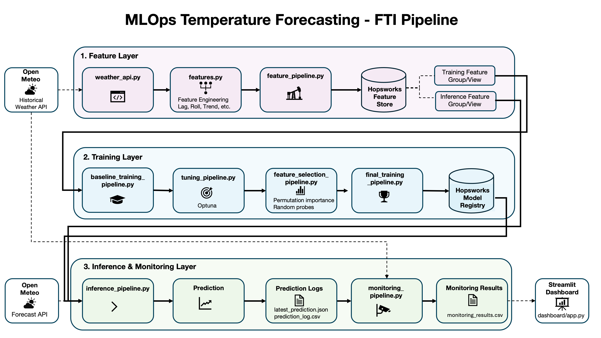
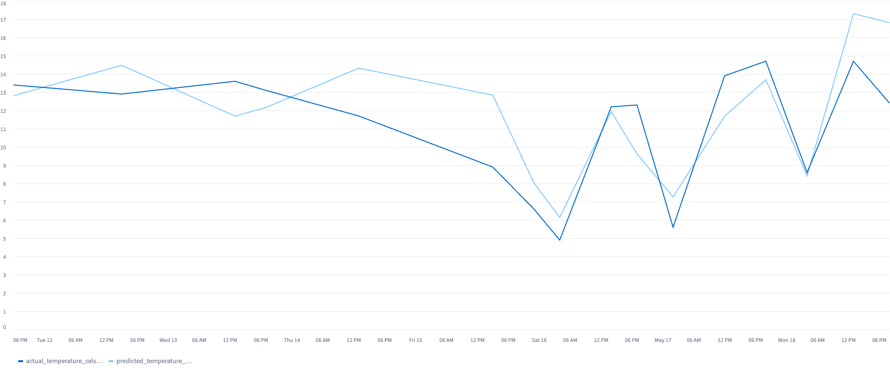

# MLOps Temperature Forecasting

End-to-end MLOps pipeline for forecasting the temperature in Basel six hours ahead.

The project follows the Feature-Training-Inference pattern and uses Open-Meteo for weather data, Hopsworks for feature storage and model registry, and local report artifacts for inference logging, monitoring and dashboarding.



## Overview

The pipeline covers three main layers:

1. **Feature Layer**  
   Fetches historical and forecast weather data from Open-Meteo, performs feature engineering and stores training and inference features in Hopsworks.

2. **Training Layer**  
   Trains baseline and final models, performs hyperparameter tuning, feature selection, model comparison and backtesting, and stores model artifacts in the Hopsworks Model Registry.

3. **Inference & Monitoring Layer**  
   Loads the latest registered model, generates live forecasts, logs predictions locally and evaluates them once the actual weather observation becomes available.

## Goal

The target is to predict the temperature in Basel six hours ahead.

```text
target = temperature_2m_next_6h
```

Example:

```text
feature_event_time:    2026-05-01 00:00:00
predicted_event_time:  2026-05-01 06:00:00
```

The target is created using timestamp-based joins on `location_id` and `event_time`, not by simple row shifting.

The following dashboard screenshot shows 15 example predictions and the actual temperature.



## Data Source

Weather data is provided by the Open-Meteo API.

```text
Location: Basel
Latitude: 47.5596
Longitude: 7.5886
Timezone: Europe/Zurich
```

The project uses:

```text
Historical Weather API  -> training and monitoring
Forecast API            -> live inference
```
- This intentionally creates a training-serving skew: the model is trained on historical weather observations, while live inference uses forecast data.
- Monitoring can only evaluate predictions later, once the predicted timestamp has become historical.

## Main Features

The feature engineering pipeline creates:

```text
current weather features
calendar features
cyclical time features
lag features
rolling-window features
trend features
```

Examples:

```text
temperature_lag_1h
temperature_lag_6h
temperature_lag_18h
temperature_lag_24h
temperature_mean_last_6h
temperature_mean_last_24h
pressure_trend_last_6h
hour_sin
hour_cos
month_sin
month_cos
```

The same feature engineering logic is used for training and inference.

## Hopsworks Feature Store Design

The project uses two Hopsworks Feature Groups:

```text
training feature group   -> historical features including the target
inference feature group  -> live inference features without the target
```

Two corresponding Feature Views are created:

```text
training feature view   -> model training interface with `temperature_2m_next_6h` as label
inference feature view  -> model serving interface used by the inference pipeline
```

The training Feature View is created explicitly to represent the model-specific training interface in the Feature-Training-Inference architecture. In the current implementation, the training dataframe is read directly from the Training Feature Group for local stability and reproducibility reasons. This avoids intermittent Hopsworks Query Service issues during local batch reads while still keeping the Feature View setup explicit.

The final model bundle stores the Feature Group and Feature View metadata together with the exact feature column order. The inference pipeline then uses the registered model metadata and the inference Feature View to build the prediction input consistently.

## Technology Stack

```text
Python
uv
pandas
scikit-learn
XGBoost
Optuna
Hopsworks Feature Store
Hopsworks Model Registry
Streamlit
pytest
ruff
GitHub Actions
Docker
```

## Project Structure

```text
dashboard/
  app.py

src/
  config.py
  weather_api.py
  features.py
  hopsworks_client.py
  hopsworks_read_utils.py
  feature_pipeline.py
  baseline_training_pipeline.py
  tuning_pipeline.py
  feature_selection_pipeline.py
  final_training_pipeline.py
  model_comparison_pipeline.py
  backtesting_pipeline.py
  inference_pipeline.py
  monitoring_pipeline.py

tests/
  test_*.py

docs/
  images/
    pipeline_diagram.png
```

## Setup

Install dependencies:

```bash
uv sync
```

Create a local `.env` file based on `.env.example`.

Required configuration includes:

```env
HOPSWORKS_HOST=eu-west.cloud.hopsworks.ai
HOPSWORKS_PORT=443
HOPSWORKS_PROJECT=your_project_name
HOPSWORKS_API_KEY=your_api_key
HOPSWORKS_ENGINE=python

LATITUDE=47.5596
LONGITUDE=7.5886
LOCATION_ID=basel
TIMEZONE=Europe/Zurich

FORECAST_HORIZON_HOURS=6
MODEL_VERSION=
```

The `.env` file contains secrets and must not be committed.

## Run the Pipeline

Create features:

```bash
uv run python src/feature_pipeline.py --days 365
```

Train baseline model:

```bash
uv run python src/baseline_training_pipeline.py
```

Tune model:

```bash
uv run python src/tuning_pipeline.py --trials 100
```

Run feature selection:

```bash
uv run python src/feature_selection_pipeline.py
```

Train final model:

```bash
uv run python src/final_training_pipeline.py
```

Run inference:

```bash
uv run python src/inference_pipeline.py
```

Run monitoring:

```bash
uv run python src/monitoring_pipeline.py
```

Start the local Streamlit dashboard:

```bash
uv run streamlit run dashboard/app.py
```

## Local Offline Mode

Several pipelines can use the local feature cache instead of reading from Hopsworks:

```bash
uv run python src/tuning_pipeline.py --trials 5 --use-cache
uv run python src/feature_selection_pipeline.py --use-cache
uv run python src/final_training_pipeline.py --use-cache --skip-upload
uv run python src/model_comparison_pipeline.py --use-cache
uv run python src/backtesting_pipeline.py
```

The local cache is stored at:

```text
data/features/temperature_features.parquet
```

## Dashboard

Start the local Streamlit dashboard:

```bash
uv run streamlit run dashboard/app.py
```

The dashboard reads local report artifacts from:

```text
reports/
```

It displays predictions, monitoring results, backtesting results, model comparison results and feature selection reports.

## Testing

Run tests:

```bash
uv run pytest
```

Run coverage:

```bash
uv run pytest --cov=src --cov-report=term-missing
```

## Code Quality

Run linting:

```bash
uv run ruff check .
```

Check formatting:

```bash
uv run ruff format --check .
```

Recommended local quality check:

```bash
uv run ruff check .
uv run ruff format --check .
uv run pytest
```

## Docker

Build the Docker image:

```bash
docker build --platform linux/amd64 -t mlops-temperature-forecasting .
```

Run inference in Docker:

```bash
docker run --rm --platform linux/amd64 --env-file .env mlops-temperature-forecasting
```

## Results

Final model performance from the v3 run:

```text
Final model:
Test MAE:  1.3591
Test RMSE: 1.8586
Test R2:   0.8914

Best naive baseline:
MAE: 4.6179

MAE improvement over best naive baseline:
70.57%
```

Backtesting result:

```text
Mean model MAE: 1.5887
Mean best naive MAE: 3.4401
Mean MAE improvement over best naive baseline: 47.63%
```

## Important Artifacts

Generated local artifacts include:

```text
reports/best_params.json
reports/tuning_results.csv
reports/permutation_importance.csv
reports/selected_features.json
reports/model_comparison_results.csv
reports/backtesting_results.csv
reports/latest_prediction.json
reports/prediction_log.csv
reports/monitoring_results.csv
```

These files are generated locally and are not committed.

## Limitations

Current limitations:

- **Single-location forecasting only:** The pipeline currently predicts temperature only for Basel.

- **Timezone-naive local event_time handling:** Event timestamps are handled as local Europe/Zurich timestamps instead of UTC-normalized timestamps.

- **Training-serving skew:** Training uses historical weather observations, while live inference uses forecast data. This means the model is not trained on exactly the same type of data that it receives during serving.

- **Training data materialization:** The training Feature View is created, but the training pipelines currently read the dataframe directly from the Training Feature Group instead of materializing a separate Hopsworks Training Dataset. This was done because direct Feature Group reads with retry and local cache fallback were more stable during local development.

- **Delayed monitoring:** A prediction can only be evaluated once the predicted timestamp has become historical and the actual observation is available.

- **Local report-based dashboard:** The dashboard reads local report artifacts instead of a persistent monitoring database.

Possible future improvements:

- Multiple locations
- UTC-normalized event time
- Historical forecast snapshots for training
- Automated retraining
- Persistent monitoring database
- Expanded dashboard filters
- Additional model families such as LightGBM, CatBoost or neural sequence models

## References & Inspiration

This project was inspired by the following resources on feature stores, MLOps workflows and time-series feature engineering:

- [Hopsworks: Quickstart Tutorial](https://github.com/logicalclocks/hopsworks-tutorials/blob/branch-4.2/quickstart.ipynb) — reference for the basic Hopsworks workflow with Feature Store, Feature Groups, Feature Views and model-oriented pipeline patterns.
- [Jim Dowling: Building Machine Learning Systems with a Feature Store](https://www.oreilly.com/library/view/building-machine-learning/9781098165222/) — conceptual reference for feature store-based machine learning systems and the Feature-Training-Inference pattern.
- [scikit-learn: Time-related feature engineering](https://scikit-learn.org/stable/auto_examples/applications/plot_cyclical_feature_engineering.html#time-related-feature-engineering) — reference for time-related and cyclical feature engineering.
- [scikit-learn: HistGradientBoostingRegressor](https://scikit-learn.org/stable/modules/generated/sklearn.ensemble.HistGradientBoostingRegressor.html) — reference for the histogram-based gradient boosting model used in the training pipelines.
- [scikit-learn: Cross-validation of time series data](https://scikit-learn.org/stable/modules/cross_validation.html#time-series-split) — reference for avoiding random train/test splits in time-series forecasting and using chronological evaluation instead.
